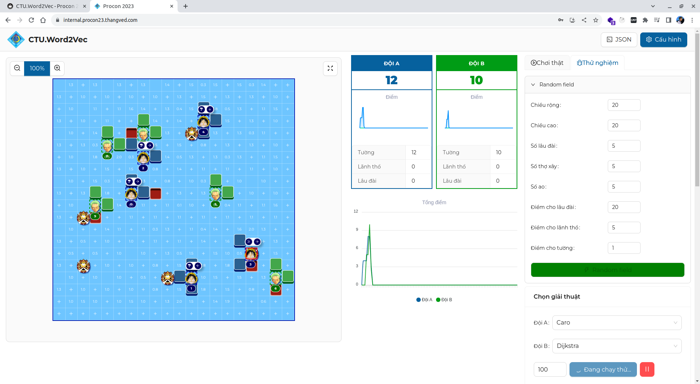

# Procon 2023 Game client

## Thông tin chung

**CTU.Word2Vec Procon 2023 Game client** được sử dụng thi đấu trong kì thi OLP tin học 2023 nội dung Procon.
Client này được viết bằng Reactjs và source nè húp đi [https://github.com/CTU-Word2Vec/procon2023](https://github.com/CTU-Word2Vec/procon2023)

## Thử nghiệm

- Các bạn có thể thử nghiệm client này tại: [https://procon23.thangved.com](https://procon23.thangved.com)
- Địa chỉ máy chủ thử nghiệm tại: [https://api.procon23.thangved.com](https://api.procon23.thangved.com) (Xem hướng dẫn máy chủ tại [đây](../game-server/0-index.md))
