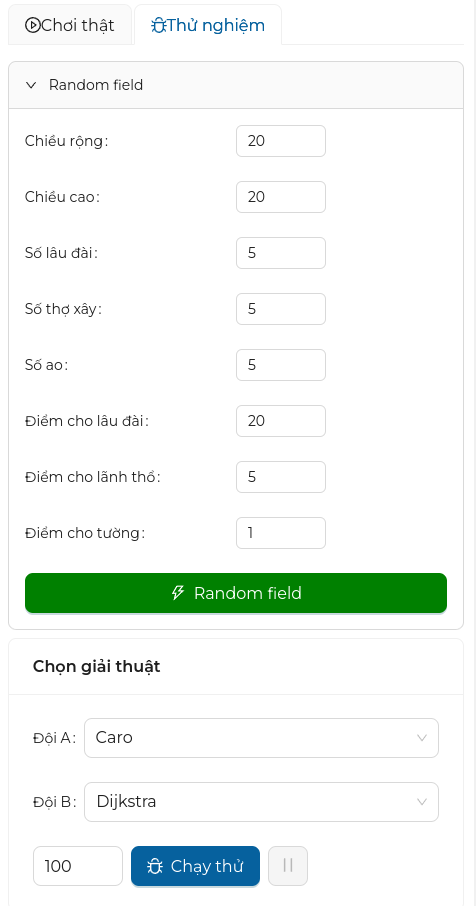

# Tổng quan về giao diện

## Bố cục

Giao diện game gồm có các phần sau:

- Phần đầu trang (header)
- Phần hiển thị trạng thái game
- Phần hiển thị điểm số
- Phần điều khiển chính

## Phần đầu trang

Phần này sẽ có vài thứ linh ta linh tinh như logo và tên của game client, ngoài ra bên phải có cái nút khi mà nhấn vào đó sẽ hiện ra bảng cấu hình game.

=== "Đây là phần đầu trang"

    

=== "Cái này là logo"

    

=== "Phần này để cấu hình client"

    

## Phần hiển thị trạng thái game

Đây là phần mà chúng ta có thể quan sát được trạng thái game một cách trực quan như vị trí thợ xây, lâu đài, lãnh thổ...

!!! tip "Mẹo"

    Có thể nhấn vào nút :octicons-zoom-in-16: để phóng to và :octicons-zoom-out-16: để thu nhỏ bản đồ cho dễ quan sát.

## Phần hiển thị điểm số

Đây là phần hiển thị điểm số của 2 đội bao gồm điểm chi tiết như tường, lâu đài, lãnh thổ và điểm tổng.
Ngoài ra tại đây còn hiển thị sự thay đổi của điểm số của 2 đội.

## Phần điều khiển chính

Đây là khu vực điều khiển và cấu hình chính khi chơi game, phần này sẽ được giới thiệu chi tiết trong phần sau.

=== "Phần điều khiển chế độ chơi thật"

    

=== "Phần điều khiến chế độ thử nghiệm"

    
