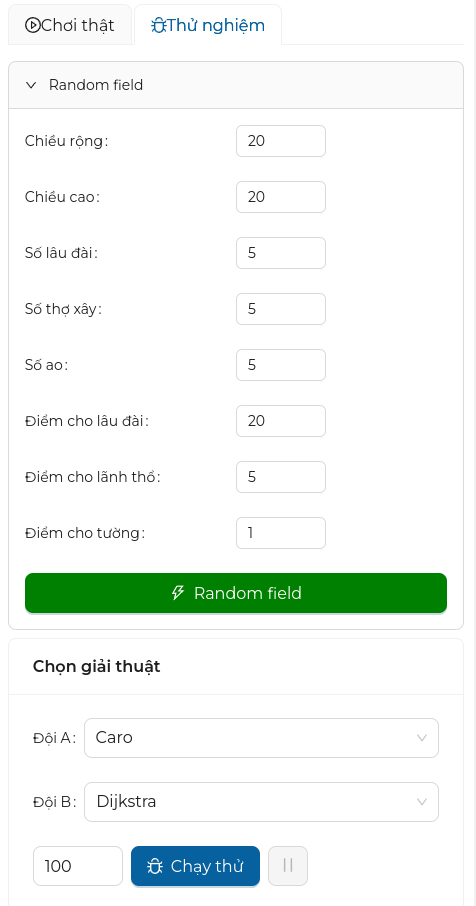
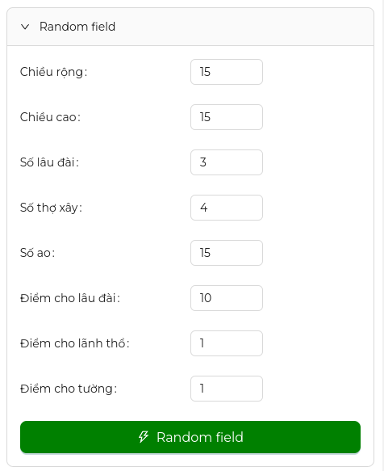
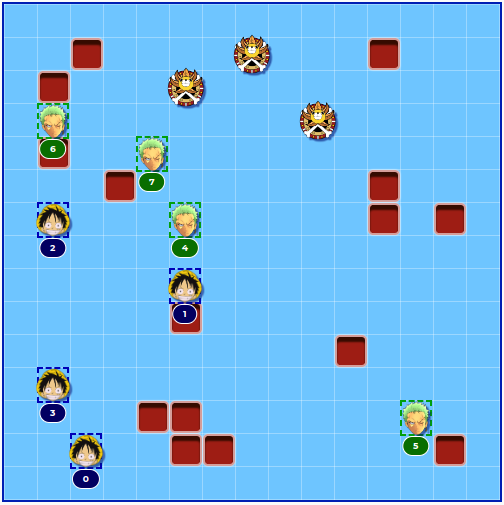
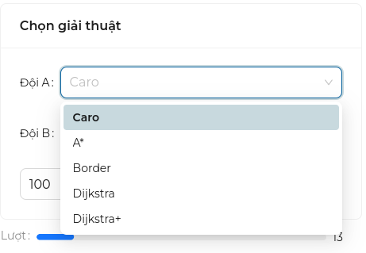

# Chế độ thử nghiệm

## Giới thiệu

Chế độ này được sử dụng cho mục đích triển khai thử nghiệm nhanh các giải thuật mới mà **không cần phải kết nối với máy chủ**.

## Hướng dẫn sử dụng

Để sử dụng chế độ này, bạn chuyển bảng điều khiển sang tab thử nghiệm

### Tạo một game ngẫu nhiên

Tại đây, ta sẽ tạo một map game ngẫu nhiên với các thông số có thể điều chỉnh như:

| Tên               | Mô tả                                 | Mặc định |
| ----------------- | ------------------------------------- | -------- |
| Chiều rộng        | Chiều rộng của map                    | `15`     |
| Chiều cao         | Chiều cao của map                     | `15`     |
| Số lâu đài        | Số lâu đài xuất hiện trên map         | `3`      |
| Số thợ xây        | Số thợ xây mỗi đội                    | `4`      |
| Số ao             | Số ao xuất hiện trên bản đồ           | `15`     |
| Điểm cho lâu đài  | Điểm dành cho đội chiếm được lâu đài  | `10`     |
| Điểm cho lãnh thổ | Điểm dành cho đội chiếm được lãnh thổ | `1`      |
| Điểm tường        | Điểm dành mỗi bức tường của mỗi đội   | `1`      |

=== "Thông số"

    Tạo một game ngẫu nhiên với các thông số sau
    

=== "Kết quả"

    

### Chọn giải thuật

Sau khi đã tạo game, bạn có thể chọn giải thuật cho đội A và đội B và bắt đầu cho chúng đấu với nhau.

