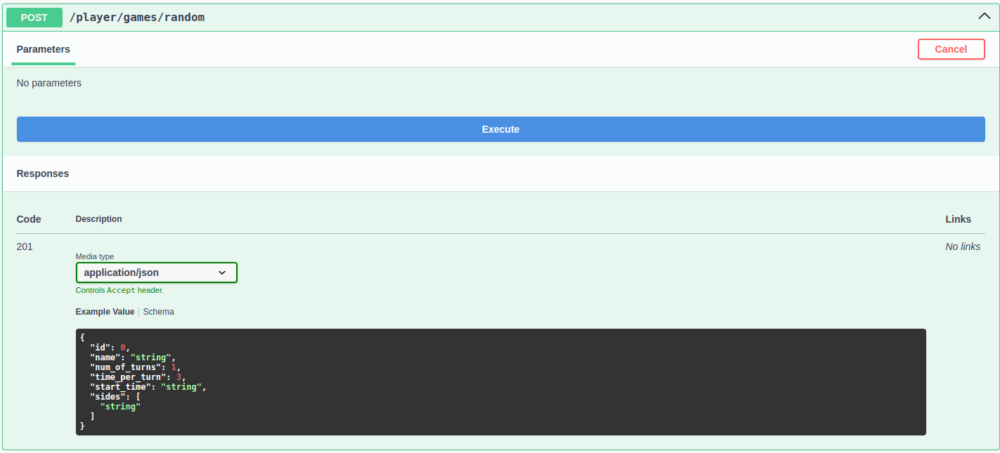

# Hướng dẫn sử dụng

## Hướng dẫn cài đặt

Xem hướng dẫn cài đặt máy chủ này tại [https://github.com/thangved/procon2023-server/](https://github.com/thangved/procon2023-server/)

## Hướng dẫn sử dụng

### Tạo một game mới

Để tạo một game mới, bạn gửi một request mới method là `POST` tới `/api/player/games/random`.
Lúc này, máy chủ sẽ tạo một game với các tham số ngẫu nhiên và gửi trả thông tin game đó về cho bạn.

!!! tip "Mẹo"

    Bạn có thể sử dụng swagger ui tại [/api-docs](https://api.procon23.thangved.com/api-docs) để gọi API từ đó.

=== "Gọi API bằng Swagger UI"

    

=== "Kết quả trả về sẽ có dạng như sau"

    ```json
    {
        "name": "ohi9es4",
        "num_of_turns": 54,
        "time_per_turn": 3,
        "start_time": "2023-12-13T06:54:03.546Z",
        "field": {
            "id": 7,
            "name": "a5swt0w",
            "castle_coeff": 20,
            "wall_coeff": 1,
            "territory_coeff": 5,
            "width": 15,
            "height": 14,
            "ponds": "[{\"x\":5,\"y\":7},{\"x\":9,\"y\":3},{\"x\":2,\"y\":11},{\"x\":12,\"y\":10},{\"x\":8,\"y\":7},{\"x\":5,\"y\":10},{\"x\":13,\"y\":2}]",
            "castles": "[{\"x\":12,\"y\":5},{\"x\":4,\"y\":12},{\"x\":2,\"y\":13}]",
            "craftsmen": "[{\"id\":\"0o5yn0a\",\"x\":4,\"y\":12,\"side\":\"A\"},{\"id\":\"21rccff\",\"x\":3,\"y\":0,\"side\":\"B\"},{\"id\":\"mt42k8l\",\"x\":4,\"y\":4,\"side\":\"A\"},{\"id\":\"a3gb56a\",\"x\":10,\"y\":0,\"side\":\"B\"},{\"id\":\"gmg74mp\",\"x\":5,\"y\":3,\"side\":\"A\"},{\"id\":\"w95wwgr\",\"x\":13,\"y\":2,\"side\":\"B\"}]"
        },
        "id": 7
    }
    ```

### Lấy danh sách game

Để lấy tất cả các game hiện có, bạn gửi một request với method `GET` tới `/api/player/games`.

??? info "Kết quả trả về có dạng như sau"

    ```json
    [
    {
        "id": 1,
        "name": "nje6van",
        "num_of_turns": 88,
        "time_per_turn": 1,
        "start_time": "2023-12-13T06:58:18.041Z",
        "sides": [
        {
            "id": 1,
            "side": "A",
            "team_name": "Team A",
            "team_id": 0
        },
        {
            "id": 2,
            "side": "B",
            "team_name": "Team B",
            "team_id": 1
        }
        ],
        "field": {
        "id": 1,
        "name": "jmulkp4",
        "castle_coeff": 20,
        "wall_coeff": 1,
        "territory_coeff": 5,
        "width": 16,
        "height": 11,
        "ponds": "[{\"x\":3,\"y\":8},{\"x\":2,\"y\":0},{\"x\":13,\"y\":1},{\"x\":12,\"y\":8},{\"x\":9,\"y\":1},{\"x\":1,\"y\":5},{\"x\":2,\"y\":6}]",
        "castles": "[{\"x\":2,\"y\":5},{\"x\":15,\"y\":9},{\"x\":6,\"y\":1},{\"x\":13,\"y\":9}]",
        "craftsmen": "[{\"id\":\"ytdxtaf\",\"x\":14,\"y\":6,\"side\":\"A\"},{\"id\":\"1rx4xky\",\"x\":9,\"y\":2,\"side\":\"B\"},{\"id\":\"y14h0wd\",\"x\":13,\"y\":7,\"side\":\"A\"},{\"id\":\"jm1mfsc\",\"x\":5,\"y\":6,\"side\":\"B\"},{\"id\":\"q9ljasb\",\"x\":9,\"y\":1,\"side\":\"A\"},{\"id\":\"hmjco7q\",\"x\":4,\"y\":9,\"side\":\"B\"},{\"id\":\"ixu7313\",\"x\":5,\"y\":1,\"side\":\"A\"},{\"id\":\"evyhugv\",\"x\":6,\"y\":0,\"side\":\"B\"}]"
        },
        "actions": []
    },
    {
        "id": 2,
        "name": "crzoma9",
        "num_of_turns": 36,
        "time_per_turn": 2,
        "start_time": "2023-12-13T06:58:20.819Z",
        "sides": [
        {
            "id": 3,
            "side": "A",
            "team_name": "Team A",
            "team_id": 0
        },
        {
            "id": 4,
            "side": "B",
            "team_name": "Team B",
            "team_id": 1
        }
        ],
        "field": {
        "id": 2,
        "name": "xjlfyq5",
        "castle_coeff": 20,
        "wall_coeff": 1,
        "territory_coeff": 5,
        "width": 19,
        "height": 17,
        "ponds": "[{\"x\":13,\"y\":2},{\"x\":14,\"y\":8},{\"x\":1,\"y\":8},{\"x\":9,\"y\":11},{\"x\":4,\"y\":5}]",
        "castles": "[{\"x\":3,\"y\":10},{\"x\":9,\"y\":12},{\"x\":17,\"y\":8}]",
        "craftsmen": "[{\"id\":\"tnk2j1t\",\"x\":0,\"y\":2,\"side\":\"A\"},{\"id\":\"2ns5nlh\",\"x\":12,\"y\":5,\"side\":\"B\"},{\"id\":\"8ycuybw\",\"x\":4,\"y\":8,\"side\":\"A\"},{\"id\":\"o8v1ay9\",\"x\":5,\"y\":0,\"side\":\"B\"},{\"id\":\"ame56d8\",\"x\":4,\"y\":0,\"side\":\"A\"},{\"id\":\"y370saz\",\"x\":9,\"y\":10,\"side\":\"B\"},{\"id\":\"t60vfqa\",\"x\":15,\"y\":9,\"side\":\"A\"},{\"id\":\"j65js4y\",\"x\":17,\"y\":14,\"side\":\"B\"},{\"id\":\"1004oan\",\"x\":9,\"y\":9,\"side\":\"A\"},{\"id\":\"7kz7dj5\",\"x\":18,\"y\":15,\"side\":\"B\"},{\"id\":\"zpwxu2a\",\"x\":11,\"y\":4,\"side\":\"A\"},{\"id\":\"uytdeiu\",\"x\":15,\"y\":3,\"side\":\"B\"}]"
        },
        "actions": []
    },
    {
        "id": 3,
        "name": "nhtcjrg",
        "num_of_turns": 42,
        "time_per_turn": 3,
        "start_time": "2023-12-13T06:58:22.393Z",
        "sides": [
        {
            "id": 5,
            "side": "A",
            "team_name": "Team A",
            "team_id": 0
        },
        {
            "id": 6,
            "side": "B",
            "team_name": "Team B",
            "team_id": 1
        }
        ],
        "field": {
        "id": 3,
        "name": "qpdys27",
        "castle_coeff": 20,
        "wall_coeff": 1,
        "territory_coeff": 5,
        "width": 16,
        "height": 18,
        "ponds": "[{\"x\":0,\"y\":12},{\"x\":10,\"y\":1},{\"x\":12,\"y\":7},{\"x\":8,\"y\":15}]",
        "castles": "[{\"x\":9,\"y\":1},{\"x\":1,\"y\":2},{\"x\":13,\"y\":16}]",
        "craftsmen": "[{\"id\":\"6ekhdgi\",\"x\":12,\"y\":16,\"side\":\"A\"},{\"id\":\"xef6rwa\",\"x\":10,\"y\":8,\"side\":\"B\"},{\"id\":\"bb3r6cg\",\"x\":8,\"y\":4,\"side\":\"A\"},{\"id\":\"y82ot3c\",\"x\":15,\"y\":2,\"side\":\"B\"},{\"id\":\"223w3jg\",\"x\":4,\"y\":7,\"side\":\"A\"},{\"id\":\"3fad92o\",\"x\":13,\"y\":7,\"side\":\"B\"}]"
        },
        "actions": []
    }
    ]
    ```

### Lấy thông tin của một game

Để lấy thông tin của một game, bạn gửi một request có method `GET` tới `/api/player/games/<game-id>(1)`.
{ .annotate }

1. Id của game mà bạn muốn lấy

??? example "Lấy thông tin của game có id là 1"

    ```json
    {
    "id": 1,
    "name": "nje6van",
    "num_of_turns": 88,
    "time_per_turn": 1,
    "start_time": "2023-12-13T06:58:18.041Z",
    "sides": [
        {
        "id": 1,
        "side": "A",
        "team_name": "Team A",
        "team_id": 0
        },
        {
        "id": 2,
        "side": "B",
        "team_name": "Team B",
        "team_id": 1
        }
    ],
    "field": {
        "id": 1,
        "name": "jmulkp4",
        "castle_coeff": 20,
        "wall_coeff": 1,
        "territory_coeff": 5,
        "width": 16,
        "height": 11,
        "ponds": "[{\"x\":3,\"y\":8},{\"x\":2,\"y\":0},{\"x\":13,\"y\":1},{\"x\":12,\"y\":8},{\"x\":9,\"y\":1},{\"x\":1,\"y\":5},{\"x\":2,\"y\":6}]",
        "castles": "[{\"x\":2,\"y\":5},{\"x\":15,\"y\":9},{\"x\":6,\"y\":1},{\"x\":13,\"y\":9}]",
        "craftsmen": "[{\"id\":\"ytdxtaf\",\"x\":14,\"y\":6,\"side\":\"A\"},{\"id\":\"1rx4xky\",\"x\":9,\"y\":2,\"side\":\"B\"},{\"id\":\"y14h0wd\",\"x\":13,\"y\":7,\"side\":\"A\"},{\"id\":\"jm1mfsc\",\"x\":5,\"y\":6,\"side\":\"B\"},{\"id\":\"q9ljasb\",\"x\":9,\"y\":1,\"side\":\"A\"},{\"id\":\"hmjco7q\",\"x\":4,\"y\":9,\"side\":\"B\"},{\"id\":\"ixu7313\",\"x\":5,\"y\":1,\"side\":\"A\"},{\"id\":\"evyhugv\",\"x\":6,\"y\":0,\"side\":\"B\"}]"
    },
    "actions": []
    }
    ```

### Một số API khác

Các bạn xem chi tiết các API tại địa [/api-docs](https://api.procon23.thangved.com/api-docs)
