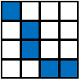
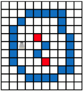
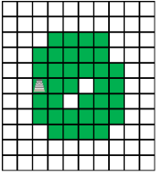
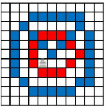
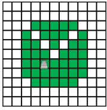
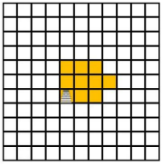
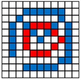
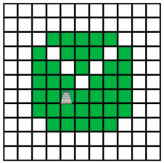

# Tường, bao vây và lãnh thổ

## Kết nối

Các Tường có thể được kết nối theo **<u>tám hướng xung quanh(1)</u>** như minh họa trong Hình 1 và 2.
{ .annotate }

1. trên/dưới/trái/phải/phía trên bên trái/phía trên bên phải/phía dưới bên trái/phía dưới bên phải

=== "Hình 1: Tường nối trên dưới trái phải"

    

=== "Hình 2: Tường nối chéo"

    

## Bao vây và lãnh thổ

Khu vực **<u>được bao quanh bởi Wall (Tường)</u>** trở thành **<u>Bao vây (Enclosure)</u>**.
Bao vây chỉ nên được bao quanh bởi Tường và không được bao gồm các cạnh của sân thi đấu.

Các khu vực không phải là **Bao vây** của riêng bạn có thể trở thành **Lãnh thổ (Territory)** của riêng bạn.
Đặc biệt, Lãnh thổ bao quanh bởi **Bao vây** được gọi là _**Lãnh thổ khép kín**_.
Như thể hiện trong **<u>Hình 3, Tường cũng như Lâu đài và Ao của đối thủ</u>** được bao quanh bởi **Bao vây** của chính bạn được coi là **<u>một phần của Lãnh thổ của bạn</u>**.
Tuy nhiên, **<u>khu vực mà bạn Bức tường của riêng bạn được định vị không phải là Lãnh thổ của bạn</u>**.

=== "Hình 3: Tường và bao vây"

    

=== "Hình 4: Lãnh thổ khép kín ở trường hợp của hình 3"

    

Các khu vực có thể là **<u>Lãnh thổ cho cả hai đội</u>**.
Khi Bao vây của đối phương được bao quanh bởi Bao vây của chính bạn như trong **Hình 5**, các khu vực được đánh dấu màu xanh lá cây và màu vàng trong **Hình 6** và **7** có thể là **Lãnh thổ cho "xanh dương" và lần lượt là các đội "đỏ"**.

=== "Hình 5: Vỏ bao quanh **Bao vây**"

    

=== "Hình 6: Lãnh thổ của đội xanh"

    

=== "Hình 7: Lãnh thổ của đội đỏ"

    

## Lãnh thổ mở

Sau khi một khu vực trở thành Lãnh thổ của bạn, **<u>nó vẫn là Lãnh thổ của bạn</u>** ngay cả khi bạn phá hủy một phần của **Bao vây** như trong **Hình 8**. Một Lãnh thổ như vậy không có Tường bao quanh được gọi là _**Lãnh thổ Mở**_.
Tuy nhiên, Tường của đối thủ hoặc Lãnh thổ đã đóng giữa các Lãnh thổ của bạn trước khi mở Vùng bao vây **<u>không còn là Lãnh thổ của bạn</u>** như trong **Hình 9**.
Khi Tường được xây dựng tại một khu vực, khu vực đó không phải là Lãnh thổ của bạn.
**<u>Nếu bạn phá hủy Bức tường như vậy một lần nữa, khu vực đó không phải là Lãnh thổ của bạn</u>**.

=== "Hình 8: Tường ngắt kết nối (màu xanh) và vỏ bọc (màu đỏ)"

    

=== "Hình 9: Lãnh thổ mở cho đội xanh tronh trường hợp của Hình 8"

    
