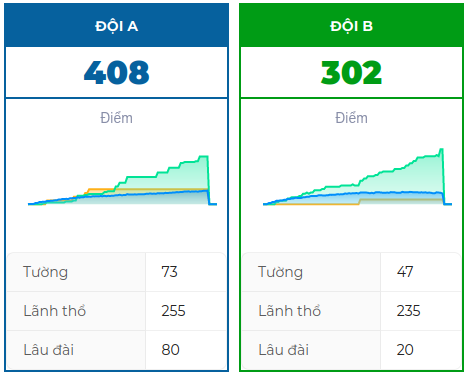

# Điểm

Số lượng Bức tường và Lãnh thổ cũng như số lượng **<u>Lâu đài trên Lãnh thổ</u>** nhân với **<u>hệ số đối với mỗi phần tử</u>** sẽ lần lượt trở thành **Wall point, Territory Point** và **Castle Point**.

