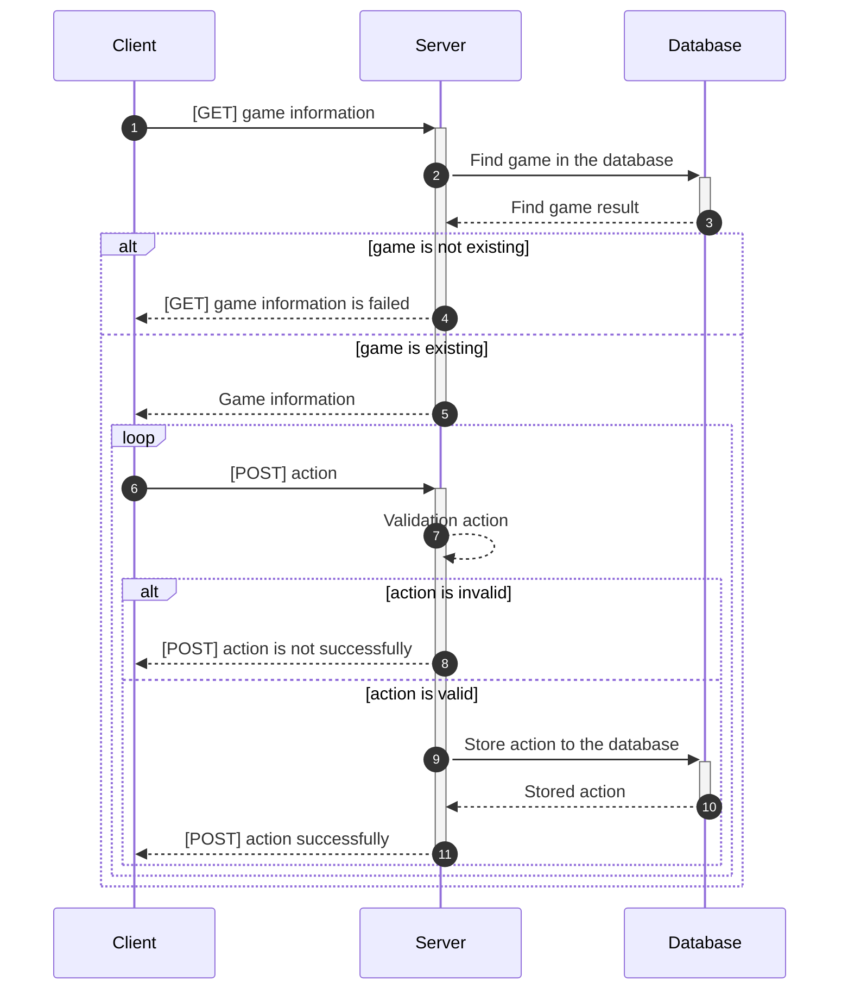

# Tiến trình của trò chơi

**<u>Hai đội lần lượt</u>** thực hiện trò chơi. Một lượt tương ứng với hành động của mỗi đội.

|    Turn     |        1        |           2           |           3            |           4           |          End           |
| :---------: | :-------------: | :-------------------: | :--------------------: | :-------------------: | :--------------------: |
| First team  |    `POST[2]`    |       `POST[4]`       |       `POST[4]`        |                       |                        |
|   Status    | `Initial state` | 1 (First team's turn) | 2 (Second team's turn) | 3 (First team's turn) | 3 (Second team's turn) |
| Second team |    `POST[3]`    |       `POST[3]`       |      `POST[End]`       |      `POST[End]`      |                        |

Một trận đấu bao gồm **<u>hai trò chơi trong đó mỗi đội thực hiện lượt đi đầu tiên</u>**.
Cùng một sân thi đấu được sử dụng cho hai ván đấu trong trận đấu.
Sân sẽ được sử dụng trong trận đấu đó sẽ được công bố vào ngày thi đấu trước khi trận đấu bắt đầu.

Mỗi đội phải xác định **<u>hành động của tất cả Thợ thủ công</u>** và đưa họ vào hệ thống thi đấu trước khi lượt tiếp theo của đội bắt đầu.
Nếu hệ thống không nhận được các hành động phù hợp, tất cả Thợ thủ công của đội không thể thực hiện bất kỳ hành động nào và phải ở lại khu vực hiện tại.

Thời lượng của một lượt được lên kế hoạch từ `3` đến `15` giây.
Thời lượng có thể thay đổi tùy theo trận đấu, nhưng sẽ giữ nguyên trong một trận đấu.

Mỗi đội có thể tự do lấy thông tin sân thi đấu từ hệ thống thi đấu trong suốt trận đấu.

Sau mỗi lượt, trạng thái nhanh chóng được chuyển sang đội khác.
Có thể xảy ra trễ thời gian khi chuyển trạng thái, vì vậy Thông tin lượt sẽ được thêm vào thông tin sân thi đấu để người chơi có thể xác định xem trạng thái đã được chuyển hay chưa.

Thông tin về lĩnh vực thi đấu bao gồm tất cả các hành động của Thợ thủ công được thực hiện ở mỗi lượt.
Sau khi hoàn thành các lượt quy định, trò chơi kết thúc và người chiến thắng được đánh giá.
Số lượt mỗi trò chơi được lên kế hoạch từ 30 đến 100 lượt, nhưng sẽ thay đổi tùy theo trò chơi.
Hai ván trong trận đấu mà mỗi đội đi lượt đầu tiên **<u>có thể thi đấu cùng lúc</u>**.
